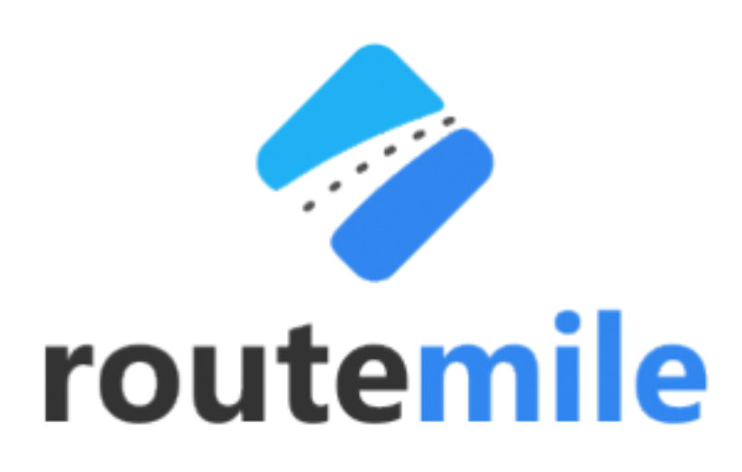
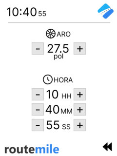
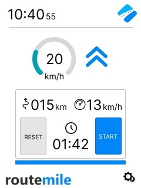
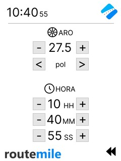
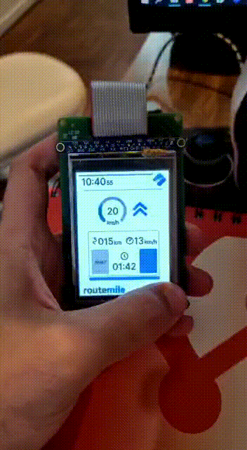
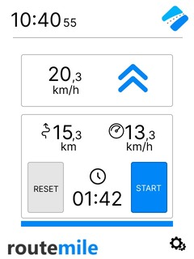
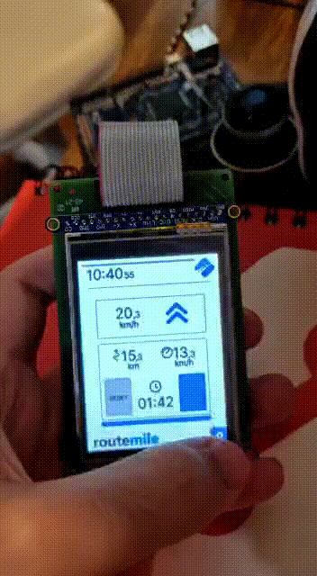

# 21b - APS2 - Embarcados

O marketing de uma empresa de equipamentos esportivos quer criar um novo ciclocomputador e você foi escolhido como desenvolvedor autônomo, dado seu background técnico e de UX, para criar um protótipo e validar a ideia.

Mais detalhes no site da disciplina:

- https://insper.github.io/ComputacaoEmbarcada/navigation/APS/APS-2-Bike/Descricao/

## Detalhes

Integrantes:

- Nicolas Maciel Queiroga 
- Francisco Pinheiro Janela

Nome da marca:

## Interface

### Proposta UX 1 - C

> - Mockup da interface:
>    - Satisfaz todos os requisitos do projeto
>    - Indica quais são os widgets do LVGL 
>    - Apresentar uma foto da interface sendo executada no LCD (imagem estática)
> - Grava um vídeo explicando a interface

Descricão da primeira proposta da interface:

  
  

 
- Vídeo explicando a interface: https://youtu.be/ZT8cxedxpbg

### Proposta UX 2 - B

> - Especifica e justifica quais vão ser as fontes (e tamanhos) a serem usadas na interface.
> - Pega feedback com o Luiz do Fablab e incorpora na interface
>   - Grava em vídeo a entrevista
> - Grava um vídeo atualizado explicando o que foi sugerido e o que fizeram para melhorar a interface
> - Apresentar uma foto da interface sendo executada no LCD (imagem estática)

Detalhes da segunda interação da proposta de interface:

<!-- 
 Adicionar texto descrevendo a evolução 
 da interface
-->

  
  

- Vídeo: https://youtu.be/45AfBP-eOn0

- Vídeo explicando a interface: https://youtu.be/QtufzRD_I88

### Proposta UX 3 - A

> - Especifica e justifica as cores a serem usadas na interface
> - Pega feedback com mais uma pessoa externa e incorpora na interface
>     - Grava em vídeo a entrevista
> - Grava um vídeo atualizado explicando o que foi sugerido e o que fizeram para melhorar a interface
> - Apresentar uma foto da interface sendo executada no LCD (imagem estática)

Detalhes da terceira interação da proposta de interface:

<!-- 
 Adicionar texto descrevendo a evolução 
 da interface
-->

  
  

- Vídeo: https://youtu.be/UX4M-INFaII

- Vídeo explicando a interface: https://youtu.be/lZ2EugiEIcE
